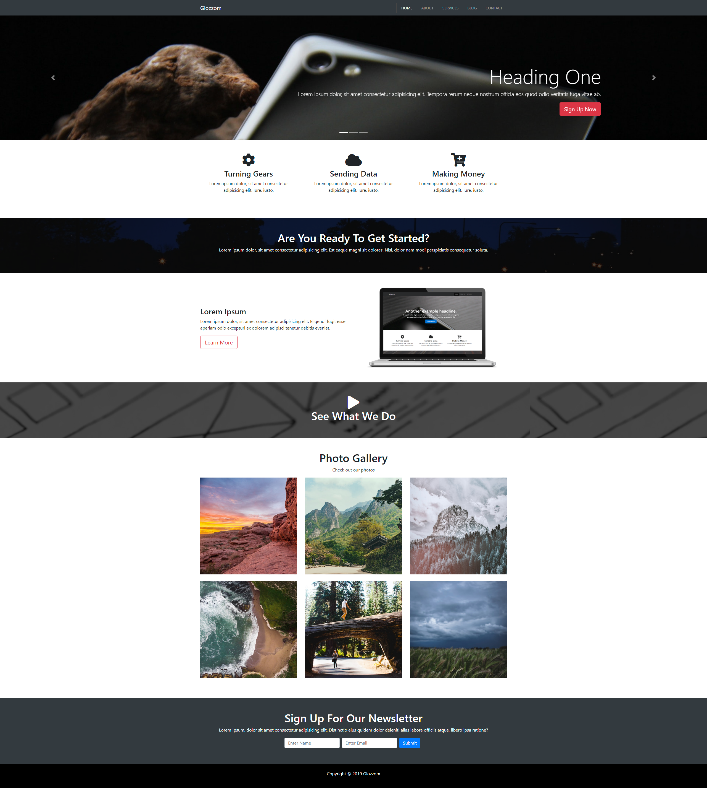

# Udemy Glozzom Project
This project is for learning purpose using Bootstrap 4.
Glozzom is a responsive multi-page theme with a carousel and some 3rd party scripts.

## Components
1. Home section
- navbar at the top with logo
- showcase area that is a **carousel** with background images
- background image with **parallax** effect (you can see different parts of the image as you scroll)
- video
- photo Gallery 
- newsletter form
- footer with copyright 
2. About section
- boxes with icons
- slider
3. Services section
- cards with headers, list groups and footers
- accordion
4. Blog
- card columns with images and texts
5. Contact section
- form

There is also implemented:
- **Ekko lightbox** to show the images in a light box from the Photo Gallery

## Screenshot of the page

## External Resources Used
This site was built using:
- [Bootstrap](https://getbootstrap.com/)
- [Font Awesome](https://fontawesome.com/)
- [Ekko-lightbox](https://cdnjs.com/libraries/ekko-lightbox)

